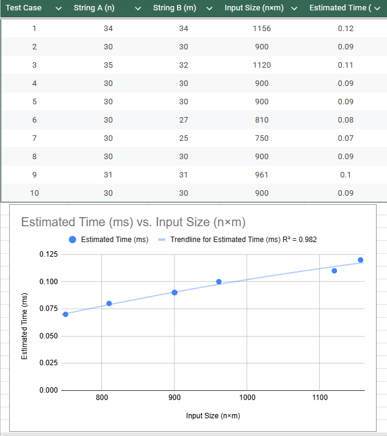

# Highest Value Longest Common Subsequence Written Component

---

## Question 1: Empirical Comparison

10 Nontrivial Input Files are as follows:

### Input Files

**FILE 1**

```
4
A 1
C 5
G 5
T 1
ACCGTTCGAACTGACTGACCGTTCGAACTGACTG
TCGAACTGACTGACCGTTCGAACTGACTGACCGT
```

**FILE 2**

```
2
0 50
1 2
101010101111000010101101010101
000011110101011011011010101010
```

**FILE 3**

```
26
a 10
b 1
c 1
d 1
e 10
f 1
g 1
h 1
i 10
j 1
k 1
l 1
m 1
n 1
o 10
p 1
q 1
r 1
s 1
t 1
u 10
v 1
w 1
x 1
y 1
z 1
thequickbrownfoxjumpsoverthelazydog
packmyboxwithfivedozenliquorjugs
```

**FILE 4**

```
10
0 0
1 1
2 2
3 3
4 4
5 5
6 6
7 7
8 8
9 9
918273645091827364509182736450
054637281905463728190546372819
```

**FILE 5**

```
5
@ 100
# 200
$ 300
% 400
& 500
@#$%%&@#$%%&@#$%%&@#$%%&@#$%%&
&$%#@&$%#@&$%#@&$%#@&$%#@&$%#@
```

**FILE 6**

```
3
X 10
Y 10
Z 10
XYZXYZXYZXYZXYZXYZXYZXYZXYZXYZ
ZZZYYYXXXZZZYYYXXXZZZYYYXXX
```

**FILE 7**

```
6
A 10
a 1
B 20
b 2
C 30
c 3
AaBbCcAaBbCcAaBbCcAaBbCcAaBbCc
cCcBbBaAaCcBbBaAaCcBbBaAa
```

**FILE 8**

```
10
Q 5
W 5
E 5
R 5
T 5
Y 5
U 5
I 5
O 5
P 5
QWERTYUIOPQWERTYUIOPQWERTYUIOP
ASDFGHJKLZXCVBNMASDFGHJKLZXCVB
```

**FILE 9**

```
3
H 100
L 1
S 1
LLLLLLLLLLLLLLLLLLLLLLLLLLLLLH
HSSSSSSSSSSSSSSSSSSSSSSSSSSSSS
```

**FILE 10**
```
15
a 3
b 7
c 2
d 8
e 1
f 9
g 4
h 6
i 5
j 10
k 12
l 11
m 13
n 15
o 14
abcdefghijklmnoabcdefghijklmno
onmlkjihgfedcbaonmlkjihgfedcba
```

### Graph of run-time




## Question 2: Recurrence Equation
1. Recurrence Equation

    Let $A = a_1 a_2 \dots a_n$ and $B = b_1 b_2 \dots b_m$. We define $V(i, j)$ as the maximum value of a common subsequence between the prefix $A[1 \dots i]$ and the prefix $B[1 \dots j]$. Let $v(c)$ be the integer value associated with character $c$.$$V(i, j) = 
\begin{cases} 
0 & \text{if } i = 0 \text{ or } j = 0 \\
V(i-1, j-1) + v(A[i]) & \text{if } A[i] = B[j] \\
\max(V(i-1, j), V(i, j-1)) & \text{if } A[i] \neq B[j]
\end{cases}$$

2. Base Cases

    The base cases handle the scenarios where one or both strings are empty:$V(0, j) = 0$ for all $0 \le j \le m$: If string $A$ is empty, no common subsequence can exist.$V(i, 0) = 0$ for all $0 \le i \le n$: If string $B$ is empty, no common subsequence can exist.In your C++ implementation, these are represented by initializing the first row and column of the memo table to zero.

3. Explanation of Correctness

    The recurrence is correct because it explores all possible ways to form an optimal subsequence by making a locally optimal choice at each step:

    - Case 1: $A[i] = B[j]$ (Match)If the current characters match, they must be part of an optimal subsequence for the prefixes ending at $i$ and $j$. Including this character adds its specific weight $v(A[i])$ to the best possible value found for the preceding prefixes ($A[1 \dots i-1]$ and $B[1 \dots j-1]$). Because character values are non-negative, including a match never decreases the total value.

    - Case 2: $A[i] \neq B[j]$ (Mismatch)If the characters do not match, the HVLCS cannot end with both $A[i]$ and $B[j]$ simultaneously. Therefore, the optimal value must be the better of two possibilities:The HVLCS of $A[1 \dots i-1]$ and $B[1 \dots j]$ (ignoring the current character of $A$).The HVLCS of $A[1 \dots i]$ and $B[1 \dots j-1]$ (ignoring the current character of $B$).By taking the maximum of these two paths, the algorithm ensures it preserves the highest accumulated value found so far.

<br>
<br>

*Complexity Note:*

- The recurrence ensures that each subproblem $V(i, j)$ is computed exactly once. Since there are $n \times m$ subproblems and each takes $O(1)$ time to compute, the overall time complexity is $O(n \times m)$, which matches the greedy-like optimization logic used in your recent algorithmic tasks.


## Question 3: Big-Oh

The pseudocode, derived from the C++ implementation, is as follows:

```
HVLCS(A, B, weights)
    n = length(A)
    m = length(B)
    
    // Create a 2D table initialized to 0
    // memo[0...n][0...m]
    Let memo[n+1][m+1] be a new table
    
    FOR i from 0 to n:
        memo[i][0] = 0
    FOR j from 0 to m:
        memo[0][j] = 0
        
    FOR i from 1 to n:
        FOR j from 1 to m:
            IF A[i] == B[j]:
                // If characters match, add the character's weight to the diagonal value
                charWeight = weights[A[i]]
                memo[i][j] = memo[i-1][j-1] + charWeight
            ELSE:
                // If no match, take the maximum value from the top or left cell
                memo[i][j] = max(memo[i-1][j], memo[i][j-1])
                
    RETURN memo[n][m]
```

The runtime of this algorithm is $O(n \times m)$, where $n$ and $m$ are the lengths of strings $A$ and $B$, respectively. Creating and initializing the memo table takes $O(n \times m)$ time. This is because the algorithm uses two nested loops. The outer loop runs $n$ times, and the inner loop runs $m$ times. Inside the loops, character comparison, weight lookup (using a hash map or array), and addition/maximum operations all take $O(1)$ constant time. Since we perform a constant amount of work for each of the $n \times m$ cells in the table, the total time complexity is $O(n \times m)$.